<p align="center">
  
</p>

# JUNCHENMO-Front（JCM LEADER）

一个开箱即用的中后台管理前端基础项目：基于 **Vue 3 + TypeScript + Vite**，内置登录鉴权、动态路由/菜单、标签页导航与常见系统管理模块，适合快速搭建企业级 Admin 并进行二次开发。

[](https://vuejs.org/)
[](https://vitejs.dev/)
[](https://www.typescriptlang.org/)
[](https://element-plus.org/)

如果你觉得这个项目对你有帮助，欢迎点个 **Star**，你的支持会让我持续迭代更多通用能力。

## 目录

- [功能亮点](#功能亮点)
- [内置模块](#内置模块)
- [快速开始](#快速开始)
- [环境变量](#环境变量)
- [项目结构](#项目结构)
- [项目截图](#项目截图)
- [脚本命令](#脚本命令)

## 功能亮点

- 登录鉴权：Token 持久化、全局路由守卫、登录状态过期处理
- 权限路由：后端下发路由/菜单，前端动态注入路由并渲染侧边栏
- 体验增强：顶部进度条、标签页导航、KeepAlive 缓存策略
- 视觉美化：布局与配色更贴近中后台产品体验，图标与动效提升观感
- 工程化：ESLint / Stylelint / Prettier、TypeScript 类型约束、Vite 高速构建

## 内置模块

- 系统管理：用户管理、角色管理、菜单管理
- 字典管理：字典项、字典值
- 日志审计：操作日志、登录日志
- 监控运维：缓存列表、缓存监控、服务监控、系统监控
- 提效工具：代码生成、AI 表结构生成、接口文档页

## 快速开始

要求：Node.js >= 18

```bash
# 安装依赖
npm i

# 本地开发（自动打开浏览器）
npm run dev
```

构建与预览：

```bash
# 生产构建
npm run build

# 本地预览构建产物
npm run preview
```

## 环境变量

项目通过 `VITE_APP_BASE_API` 配置接口地址（Axios baseURL）。

- 开发环境：`.env.development`
- 测试环境：`.env.test`
- 生产环境：`.env.production`

接口请求封装见 [request.ts](src/utils/request.ts)。

## 项目结构

```text
src
├─ api          接口层（按业务域拆分）
├─ assets       静态资源（图标、字体、图片）
├─ components   通用组件
├─ enum         枚举与常量
├─ layout       布局（菜单、Tabs、面包屑等）
├─ mock         Mock 数据（开发/测试用）
├─ router       路由与鉴权守卫
├─ store        Pinia 状态管理（按模块拆分）
├─ styles       全局样式与主题覆盖
├─ utils        工具与请求封装
└─ views        页面（按业务模块组织）
```

## 项目截图

<details>
<summary>点击展开</summary>

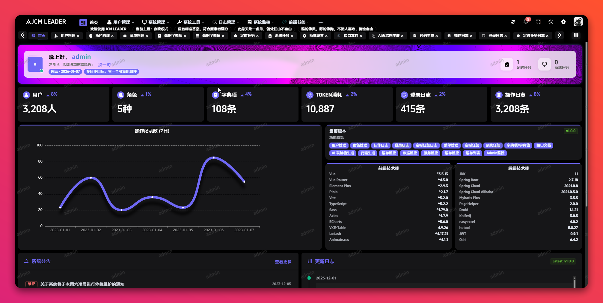
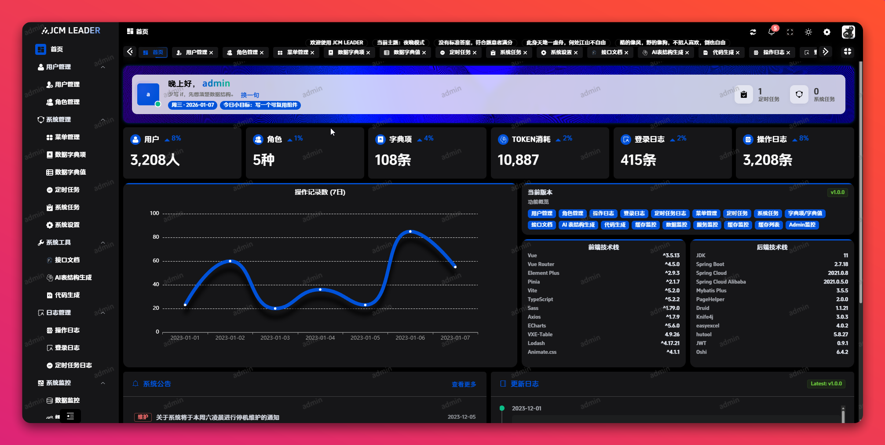
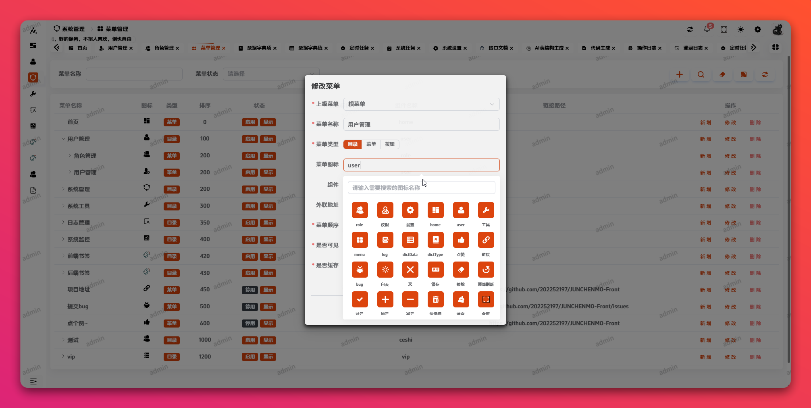
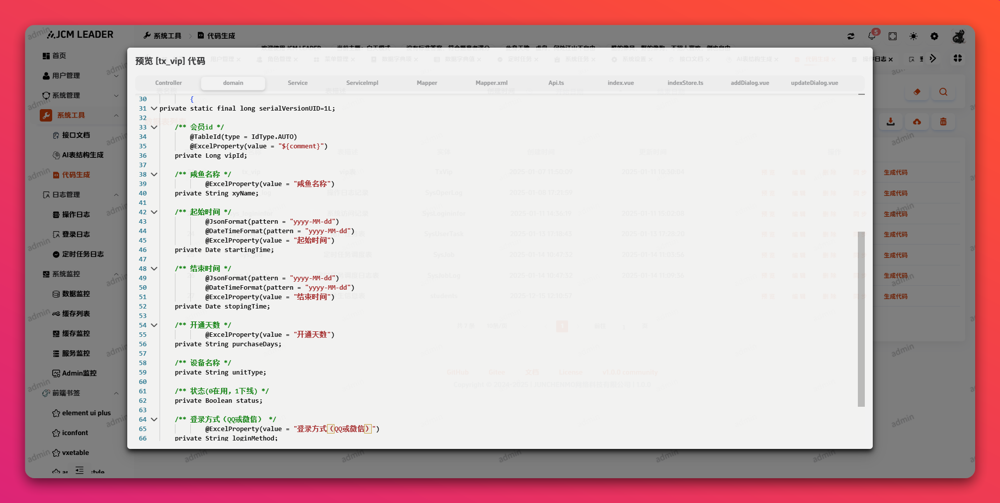
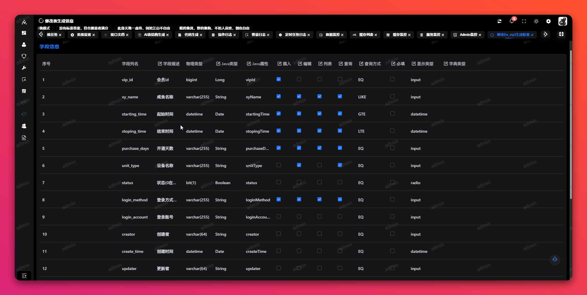
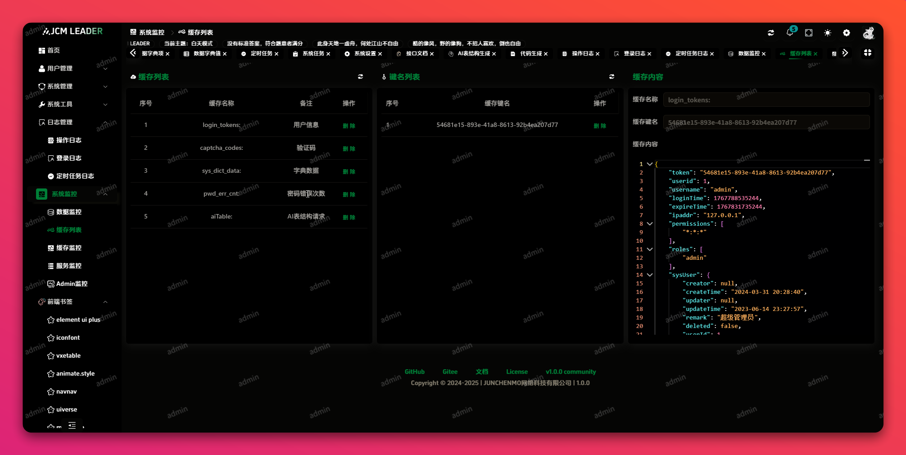
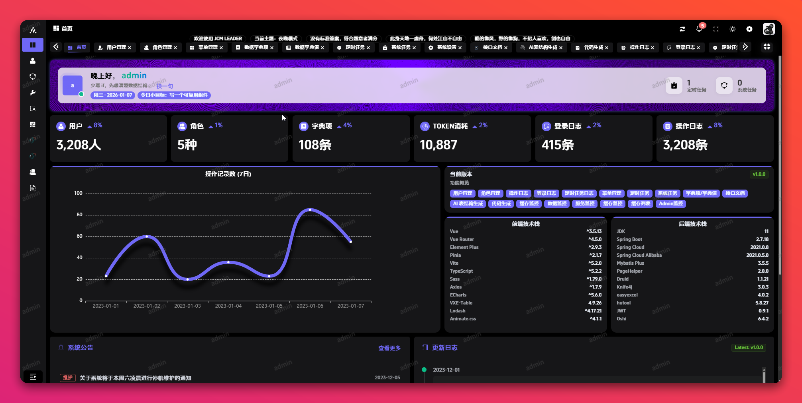
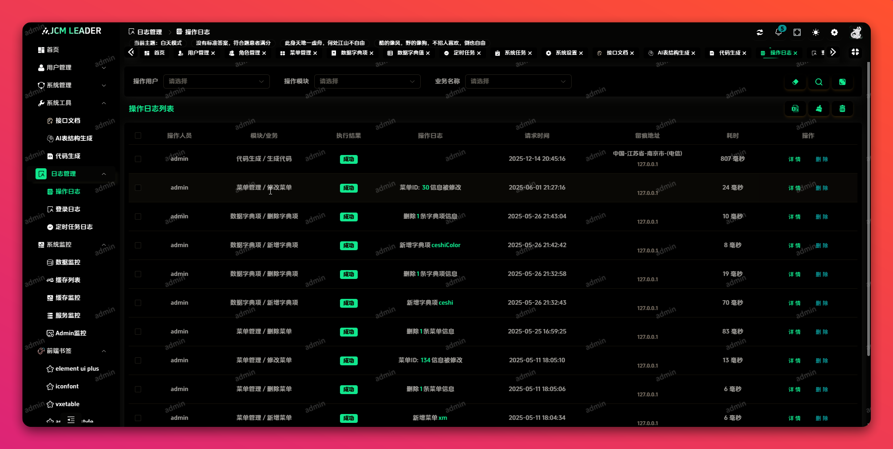
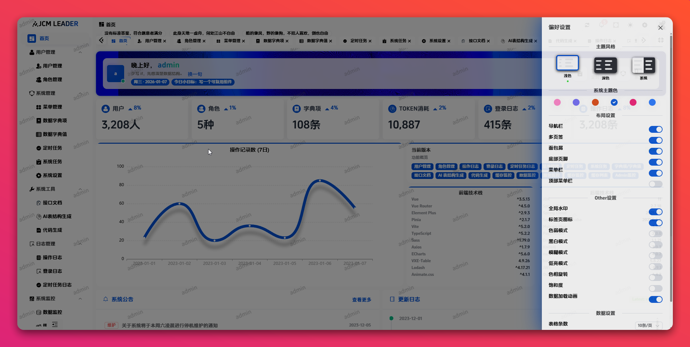
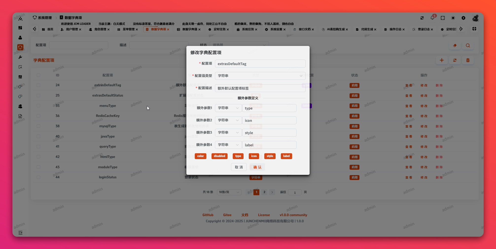

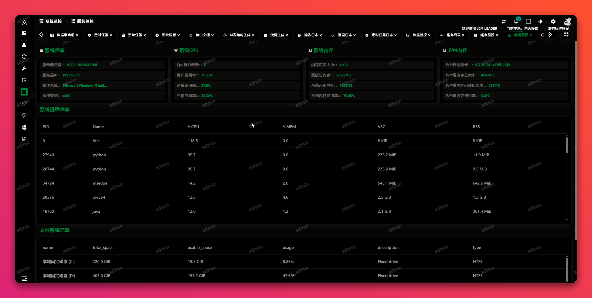
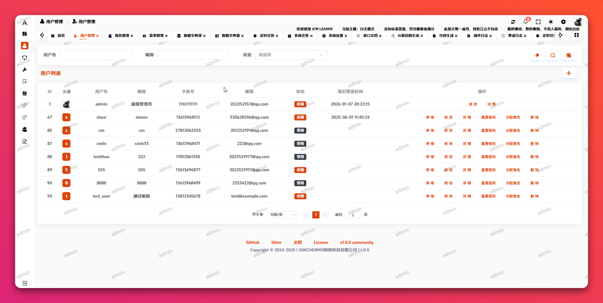
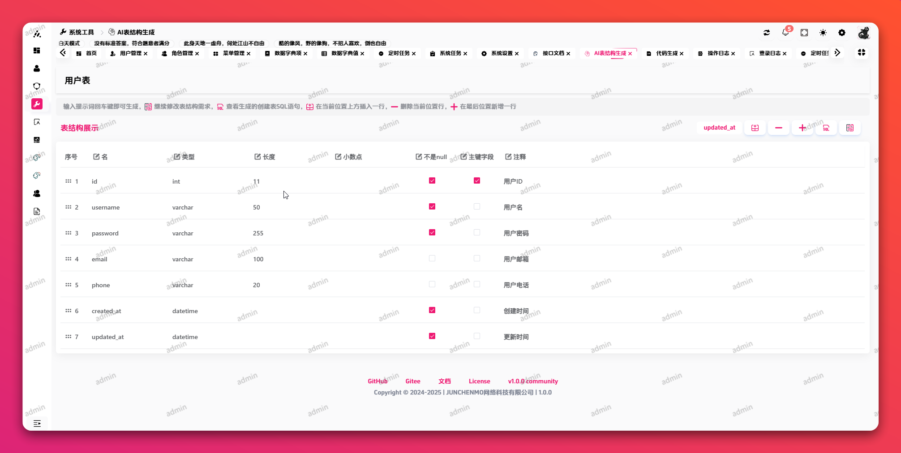
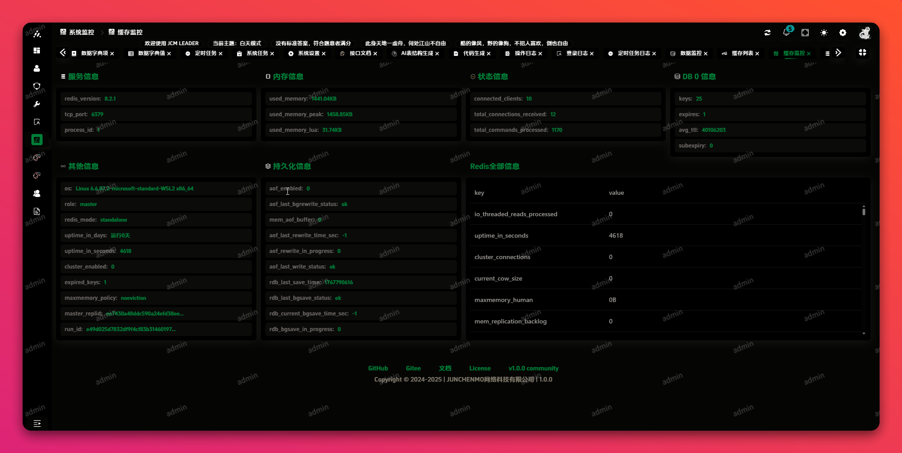

</details>

## 脚本命令

```bash
npm run dev        # 开发启动
npm run build      # 构建
npm run preview    # 预览构建产物
npm run lint       # eslint 检查
npm run fix        # eslint 自动修复
npm run lint:style # stylelint 自动修复
npm run format     # prettier 格式化
```
