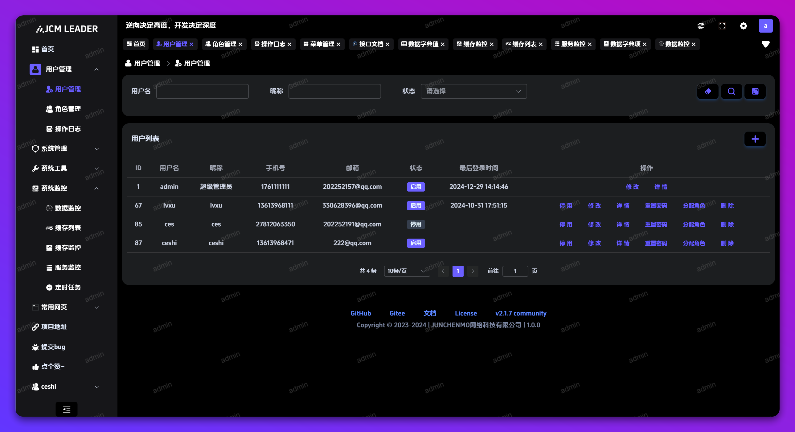
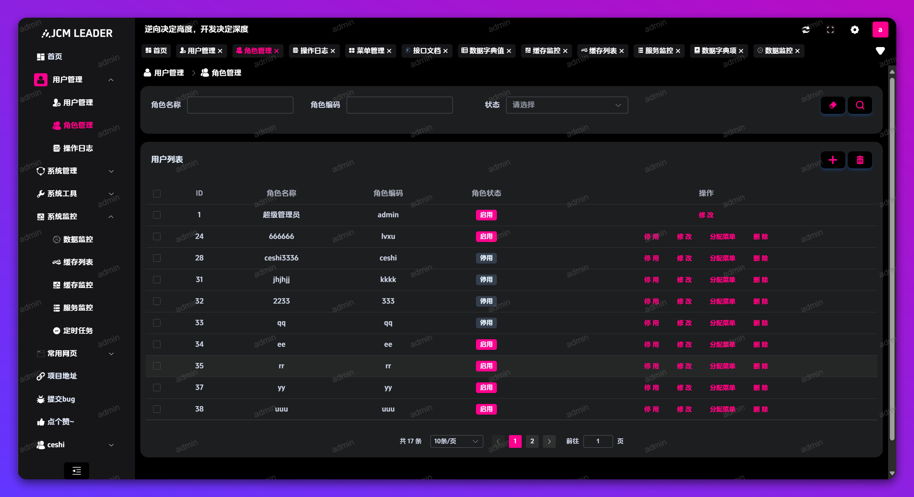
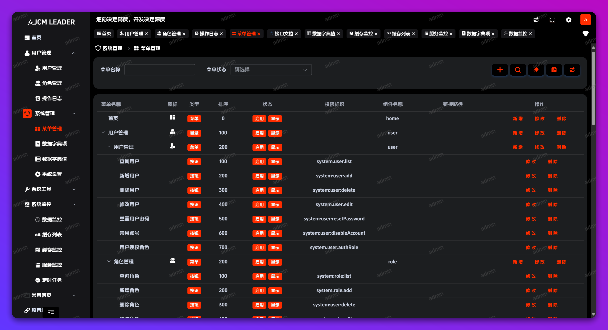
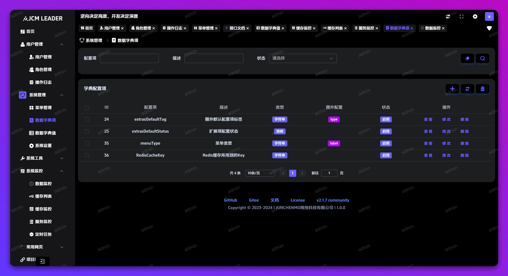
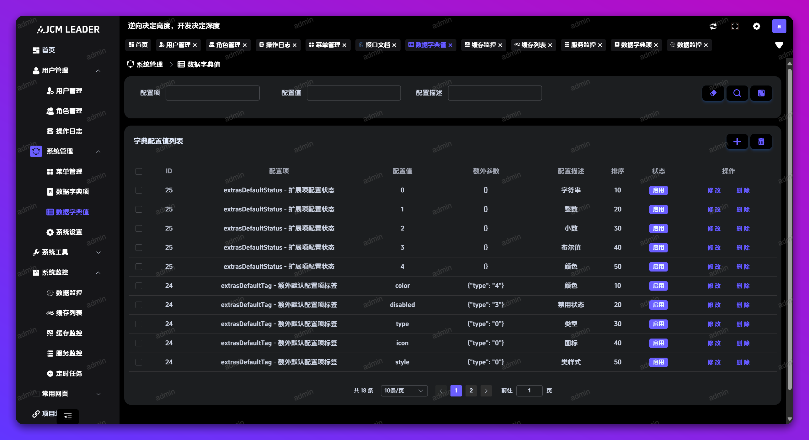
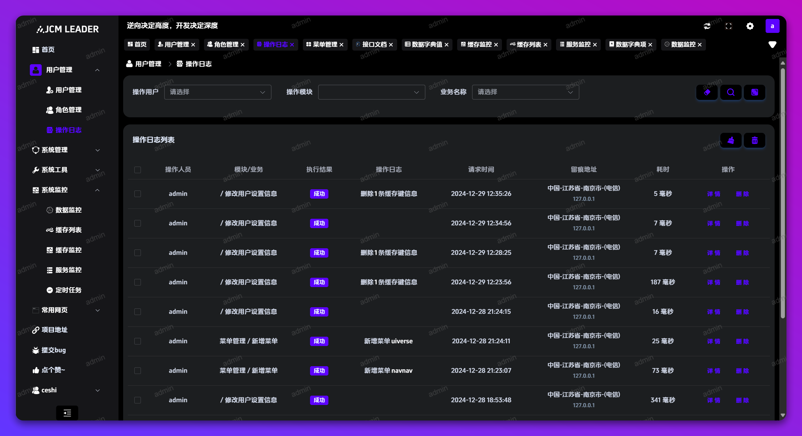
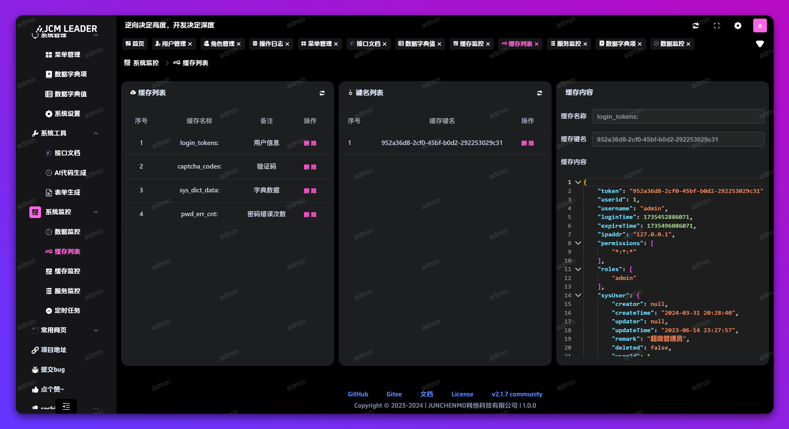
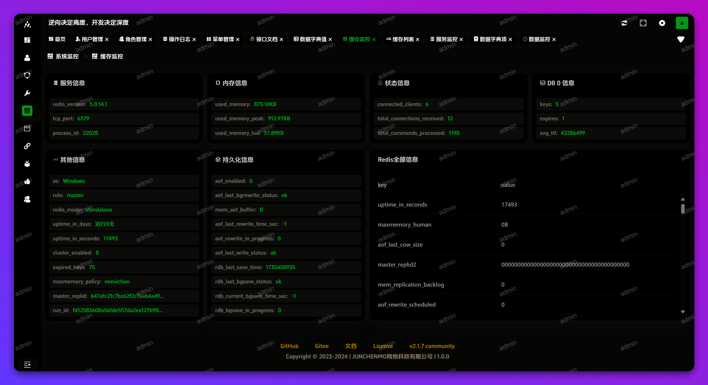
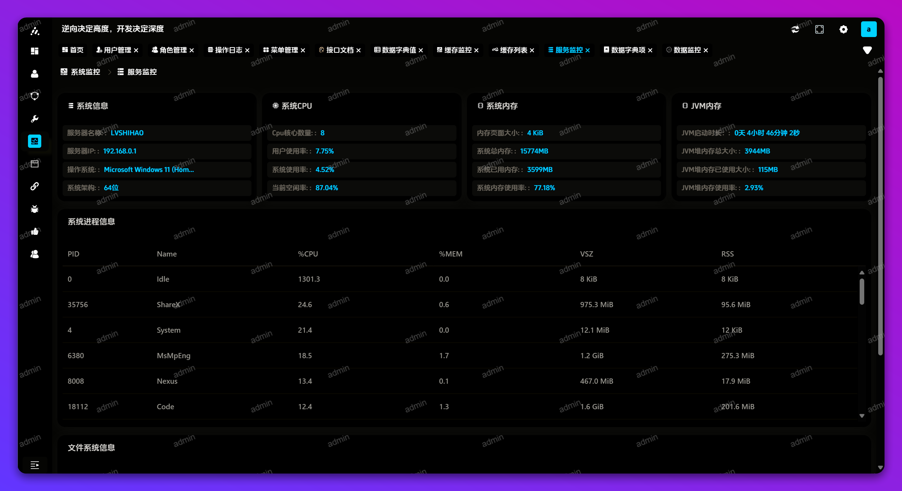

# What project is this

The is my base front project

| 技术架构     | 版本    | 描述         |
| ------------ | ------- | ------------ |
| vue          | ^3.4.21 | 框架         |
| axios        | ^1.6.8  | 请求接口     |
| element-plus | ^2.6.2  | UI           |
| pinia        | ^2.1.7  | 管理页面状态 |
| vue-router   | ^4.3.0  | 路由         |
| nprogress    | ^0.2.0  | 进度条加载   |

| 开发依赖   | 版本    | 描述              |
| ---------- | ------- | ----------------- |
| sass       | ^1.72.0 | 样式语言          |
| typescript | ^5.2.2  | 脚本语言          |
| vite       | ^5.2.0  | 构建工具          |
| eslint     | ^8.57.0 | 检查JS代码的工具  |
| stylelint  | ^14.6.0 | 检查CSS代码的工具 |
| mockjs     | ^1.1.0  | 模拟接口测试工具  |
| prettier   | ^3.2.5  | 代码格式化工具    |

| src目录下的文件夹 | 描述                      |
| ----------------- | ------------------------- |
| api               | 存放axios调用后端接口文件 |
| components        | 存放通用组件              |
| layout            | 存放页面布局              |
| mock              | 存放测试接口数据          |
| store             | 存放页面状态              |
| styles            | 存放样式                  |
| utils             | 存放工具类                |
| views             | 存放页面                  |

# Project View

